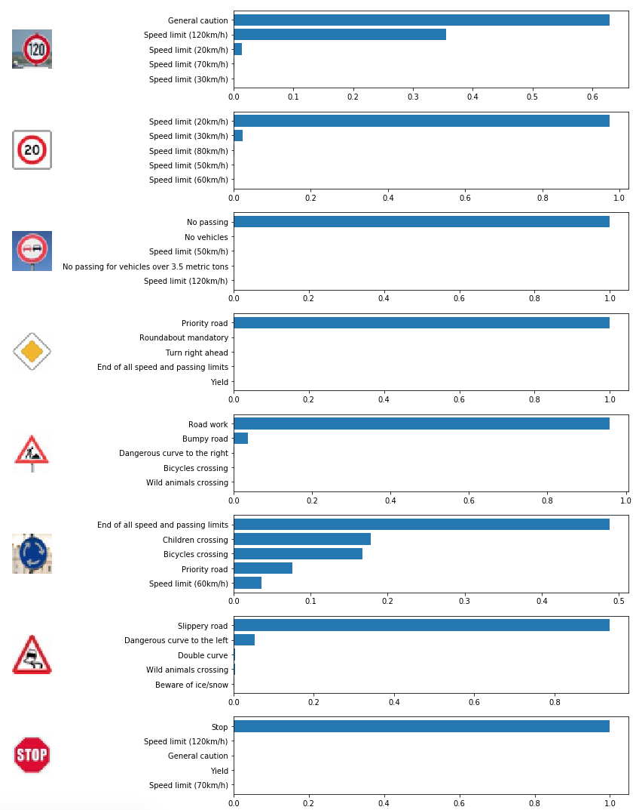

# Traffic Sign Classifier

## Overview
Convolutional Neural Network (CNN) to classify traffic signs from the [German Traffic Sign Dataset](http://benchmark.ini.rub.de/?section=gtsrb&subsection=dataset). The model is based on the famous [LeNet-5 architecture](http://yann.lecun.com/exdb/lenet/)

### Dataset Exploration and Augmentation
The German Traffic Sign Dataset contains 51,839 images with 43 different unique sign types (classes). Each image has been resized to 32x32x3. Examples:

The uneven distribution of image examples can be seen below. Speed limit signs (class #s 1-8), as well as No Passing for vehicles over 3.5 metric tons (10), Priority Road (12), Yield (13), and Keep Right (38) have high frequncies. This uneven training set distribution could cause the model to bias towards these classes. Whether this bias is justified or not isn't clear. Perhaps these frequencies reflect real occurance frequencies on the actual roads? This is something to explore.

#### Augmentation
Augmenting the dataset can help account for the uneven distribution of classes and give the CNN more examples to train. The CNN model was trained in 2 ways: (1) Augmenting the dataset without concern for balancing classes. For each image, apply transformations (described below) to create 3 additional images. Augmented training set size: 156,836 (2) Augmenting the dataset to balance each class frequency to 3,000 samples. Augmented training set size: 129,000

In both cases, for each traffic sign, augmentation was implemented by applying random brightness, affine warp, and translation

### Preprocessing
Apply grayscale, histogram equalization, and pixel normalization 

 

### CNN Architecture
This model is based off of the LeNet-5 architecture. Two convolutional layers, each activated with relu activation function. Then pooling layer, a flatten layer, and 3 fully connected layers. 

Loss function: softmax cross entropy
Use scikit-learn's cross-validator StratifiedShuffleSplit to generate training and validation sets that preserve the percentage of samples for each class. 

Hyperparameters:
* Optimizer = AdamOptimizer
* epochs = 25
* Batch size = 128
* Learning Rate = 0.001
* Kepp Probability = 0.5

Final test set accuracy: 94.9%

#### Weights Visualization
Visualization CNN feature map in response to test stimuli. 

### Predicting new signs
Model predictions on new images taken from a google search. Original image (top), output of preprocessing (bottom)

Softmax probabilities of predicted classes

## Dependencies

* Python 3
* OpenCV
* Numpy
* matplotlib
* tensorflow
* Jupyter Notebook
* sklearn, skimage
* [Download the dataset](https://d17h27t6h515a5.cloudfront.net/topher/2016/November/581faac4_traffic-signs-data/traffic-signs-data.zip). This is a pickled dataset in which the images have been resized to 32x32.

Note: Udacity has a handy Anaconda environment that includes many of the dependencies used in the Self-Driving Car Nanodegree: [CarND Term1 Starter Kit](https://github.com/udacity/CarND-Term1-Starter-Kit/blob/master/README.md)

## Running the code 
The project is completed in a Jupyter notebook. 
To start Jupyter in your browser, run the following command at the terminal prompt and within your Python 3 environment:

`> jupyter notebook`

